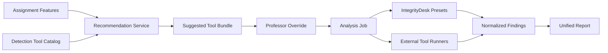

# Backend Architecture Cleanup Plan

## Current Stable Runtime Surface

- API and entrypoints: `src/backend/main.py`, `src/backend/api/`
- Application orchestration: `src/backend/application/`
- Detection and scoring engines: `src/backend/engines/`
- Shared runtime support: `src/backend/infrastructure/`, `src/backend/config/`,
  `src/backend/models/`

## Target Structure

```text
src/backend/
  api/                # FastAPI routes, schemas, middleware
  application/        # Use cases and orchestration
  domain/             # Domain models and decision rules
  engines/            # Detection, similarity, scoring, execution engines
  infrastructure/     # DB, reporting, indexing, email, parsing
  config/             # Settings and environment wiring
  models/             # Persistence models
  backend/            # Compatibility namespace for legacy imports

benchmark/            # Offline benchmark harness and datasets
evaluation/           # Offline comparative and statistical evaluation
legacy/               # Quarantined deprecated code
docs/                 # Architecture, research, and task coordination
tests/                # Unit and integration tests
```

## Migration Rules

1. No import path should break during the first cleanup phase.
2. Runtime API code must not depend on deprecated or quarantined modules.
3. Benchmark and evaluation moves should happen behind shims or import rewrites.
4. Duplicate filenames should be reduced gradually, starting with the most
   collision-prone utility and reporting modules.

## Phase 1 Implemented Here

1. Added `src/backend/backend/` as a compatibility namespace so legacy imports
   resolve without copying code.
2. Added a structural audit script to expose duplicate basenames and legacy
   directories.
3. Documented the split between runtime code, offline benchmark code, and
   quarantined legacy code.

## Recommended Next Moves

1. Rewrite imports from `src.backend.backend.*` to `src.backend.*`.
2. Freeze `bootstrap_disabled/` as legacy-only and remove any accidental new
   imports.
3. Create a dedicated top-level home for benchmark and evaluation code, then
   move modules in small batches with import shims.
4. Rename the most duplicated filenames with package-specific names such as
   `similarity_ast.py`, `benchmark_metrics.py`, or `report_generation_service.py`
   once call sites are updated.

---

# Unified Detection Platform Architecture

## Product Objective

IntegrityDesk should become the single professor-facing platform for selecting,
running, comparing, and explaining multiple code-integrity detectors. The native
IntegrityDesk engine remains central, but MOSS, JPlag, Dolos, NiCad, and future
tools should be exposed through the same catalog, job, and report workflow.

## Target Module Plan

```text
src/backend/
  api/
    routes/
      detection_tools.py      # Catalog and recommendation endpoints
  application/
    detection_tools/
      catalog_service.py      # Product-facing tool metadata and availability
      recommendation_service.py
      schemas.py              # Assignment profile and recommendation DTOs
  engines/
    execution/                # Existing external tool runners and adapters
    similarity/               # Native IntegrityDesk presets
  infrastructure/
    reporting/                # Unified reports and evidence formatting
```

The first implementation slice should add `application/detection_tools/` and an
API route without moving benchmark code. Once stable, benchmark registry metadata
can be consolidated with the product catalog behind a compatibility layer.

## Data Flow

```text
Professor assignment setup
  -> AssignmentFeatureProfile
  -> RecommendationService
  -> Suggested tool bundle with explanations
  -> Professor overrides or accepts
  -> Multi-tool analysis job
  -> Tool runners and native engines
  -> ToolFinding/Finding normalization
  -> Unified report with per-tool evidence and failures
```

## Catalog Boundary

The catalog owns product-facing metadata:

- tool id and display name
- category: native preset, external detector, benchmark-only, disabled
- supported languages
- strengths and cautions
- configuration requirements
- availability status
- selectable state

The catalog should not execute tools. It may call lightweight availability
checks, but it must not start expensive analysis jobs.

## Recommendation Boundary

The recommendation engine accepts an assignment profile:

- language
- assignment size
- starter-code amount
- expected transformations
- AI-assistance concern
- need for professor-trusted legacy tools
- desired speed versus depth

It returns a ranked list of recommended tools or presets with reasons. The
professor can override the list before running analysis.

## Orchestration Boundary

The orchestration layer should run selected tools as one analysis request while
preserving independent tool status:

- `queued`
- `running`
- `succeeded`
- `failed`
- `unavailable`
- `timed_out`

Reports should show partial success clearly. One unavailable external tool must
not erase successful IntegrityDesk findings.

## First Implementation Slice

1. Add a read-only catalog service that reuses current tool metadata where safe
   and corrects real local paths for installed tools.
2. Add a deterministic recommendation service with simple rules and explanatory
   reasons.
3. Add unit tests for catalog filtering, availability flags, and
   recommendation reasons.
4. Defer real multi-tool execution UI and background job orchestration until the
   catalog/recommendation contract is stable.

## Diagram



## Developer Handoff

Implement catalog and recommendation as the first slice. Do not run external
tools yet. Keep the API read-only, deterministic, and testable. The Developer
should inspect existing route/schema patterns before choosing exact filenames.
